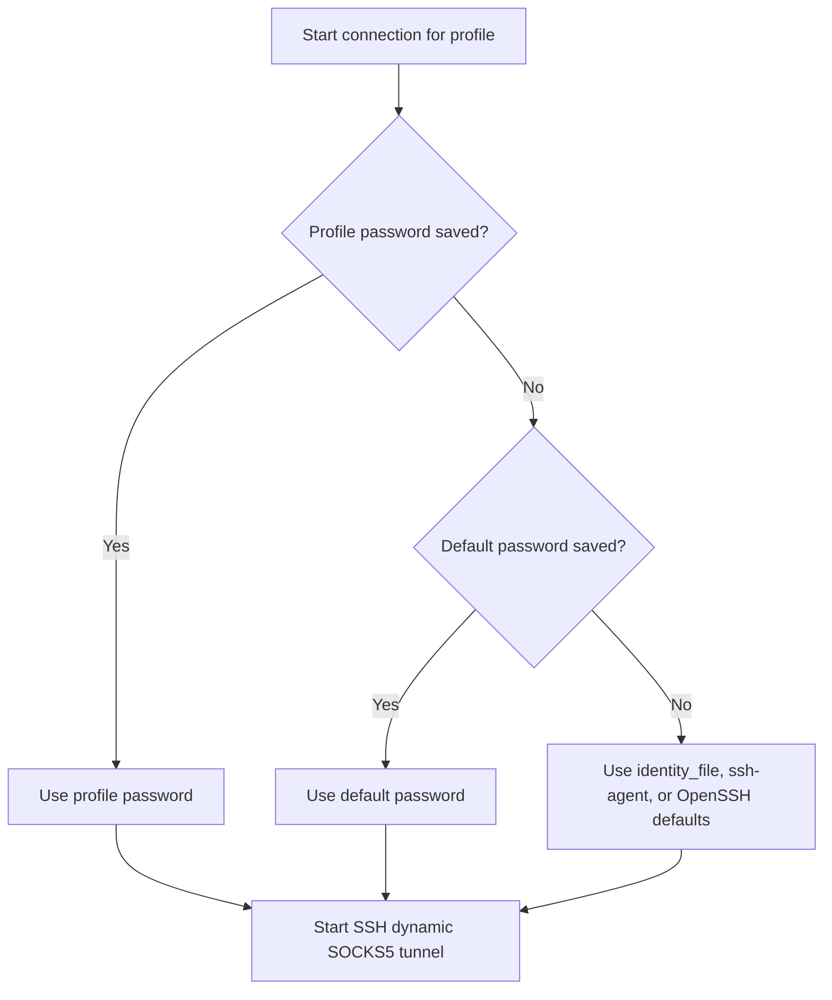

# SSH Proxy

A pure Bash application for managing SSH dynamic SOCKS5 tunnels.

SSH Proxy is designed to be small, inspectable, and easy to operate from a
terminal. It uses the system OpenSSH client to create local SOCKS5 tunnels and
keeps connection state, logs, and credentials in the application directory.

## Interface preview

The following is a simulated console view. Hostnames, users, and statuses are
example values for illustration only:

```text
+------------------------------------------------------------+
|                         SSH PROXY                          |
|              Dynamic SOCKS5 Tunnel Manager                 |
+------------------------------------------------------------+
A lightweight Bash console for SSH dynamic SOCKS5 tunnels.
Automatic reconnect, external profiles, and optional password storage.

Profile file: /path/to/ssh-proxy-profiles.ini

  NAME               SERVER                             STATUS       SOCKS_PORT
  ------------------ ---------------------------------- ------------ ------------
> gateway            user@gateway.example.com:22       CONNECTED    127.0.0.1:7070
  backup             user@backup.example.com:22         STOPPED      127.0.0.1:7070

Up/Down or j/k: select   Enter/t: start/stop   r: restart   l: logs   c: interactive connect   f: reload config
 p: save profile password   g: save default password   d: delete profile password   x: delete default password   q: quit
```

`CONNECTED`, `STARTING`, `RECONNECTING`, and `STOPPED` are live states read
from the local runtime status files. The main screen refreshes when a state
change is detected. The profile list and settings are also reloaded when the
INI file changes; the file is checked once per minute. Press `f` to reload the
configuration immediately. Updates to an active tunnel take effect after
restarting it.

## Highlights

- Pure Bash implementation with no language runtime, framework, or third-party
  service.
- Uses standard OpenSSH dynamic forwarding (`ssh -D`) for the proxy tunnel.
- Supports private keys, `ssh-agent`, profile passwords, and a shared default
  password.
- Detects disconnects, updates the status, sends a terminal bell, optionally
  sends a macOS notification, and reconnects with configurable backoff.
- Keeps the implementation transparent: configuration, logs, runtime state,
  and password-handling code are all available as local text files and shell
  code.

## Security and transparency

SSH Proxy does not relay traffic through a hosted service and does not embed
personal accounts or server credentials in the script. The actual SSH
connection is handled by the system OpenSSH client, while the Bash code remains
available for inspection and review.

Configuration, credentials, logs, process IDs, and status files are kept in the
application directory and excluded from Git by `.gitignore`. Password files
use restrictive permissions and triple Base64 obfuscation, but Base64 is not
encryption. For stronger authentication, use a private key or `ssh-agent`.

## Requirements

- macOS or Linux
- Bash and OpenSSH client (`ssh`)
- `base64`, `tr`, `stty`, and `cksum`
- `lsof` is optional and used for local port checks

## Usage

Run from the application directory:

```bash
./ssh-proxy
```

Global options:

```text
--config <path>     Use a custom profile file
--state-dir <path>  Use a custom runtime directory
--no-notify         Disable macOS notifications
--help              Show help
--version           Show version
```

## Configuration

The default profile file is `ssh-proxy-profiles.ini`.

```ini
[settings]
reconnect = yes
max_retries = 0
retry_delay = 5
max_retry_delay = 60

[gateway]
host = gateway.example.com
user = user
ssh_port = 22
local_socks_port = 7070
identity_file = ~/.ssh/id_ed25519

[backup]
host = backup.example.com
user = user
ssh_port = 22
local_socks_port = 7070
identity_file = -
reconnect = no
max_retries = 3
```

Each server uses its own INI section. Values in `[settings]` apply globally
and can be overridden in an individual server section.

| Field | Description |
| --- | --- |
| `host` | Remote SSH hostname or IP address |
| `user` | SSH username |
| `ssh_port` | Remote SSH port |
| `local_socks_port` | Local SOCKS5 port; default profiles use `7070` |
| `identity_file` | Private key path, or `-` for ssh-agent/default keys |
| `reconnect` | Enable or disable automatic reconnect |
| `max_retries` | Maximum reconnect attempts; `0` means unlimited |
| `retry_delay` | Initial reconnect delay in seconds |
| `max_retry_delay` | Maximum reconnect delay in seconds |

Only one profile can run at a time when profiles share local port `7070`.

## Design overview

SSH Proxy separates configuration, authentication, tunnel supervision, and
the console UI:

1. The INI file defines shared reconnect defaults and one independent section
   for each server profile.
2. The supervisor starts `ssh -D 127.0.0.1:<port>`, watches the child process
   and local listening port, and writes status and log files.
3. If SSH exits unexpectedly, the supervisor optionally retries with
   exponential backoff. A successful connection resets the retry counter.
4. The console reads the status files and presents the available actions. A
   normal start delegates the long-running tunnel to a background supervisor;
   interactive mode keeps the terminal attached until the user returns to the
   console or stops the connection.

### Authentication choices

For each profile, SSH Proxy selects credentials using the following priority:



The profile password is intended for one server profile only. The default
password is a fallback shared by profiles that do not have their own saved
password; it is useful when several profiles use the same account password.
Saving a profile password therefore overrides the default for that profile.

Passwords are stored as triple Base64 in `credentials/`. This is only
obfuscation, not encryption. File permissions are restricted to the current
user, but SSH keys or an SSH agent are preferable whenever available.

### Interactive mode

The `c` action opens an interactive SSH connection for the selected profile so
that password, MFA, keyboard-interactive, or other terminal prompts can be
answered directly. Interactive mode uses SSH's `ask` host-key policy, so the
first connection can be confirmed by the user. Normal background starts use
`accept-new`: a new host key is saved automatically, while a changed known-host
key is still rejected. Once the SOCKS tunnel is connected, press Enter or `r`
to return to the main console while keeping the tunnel running. Press Ctrl-C
in interactive mode to stop the tunnel and return.

## Console controls

| Key | Action |
| --- | --- |
| Up / Down, `j` / `k` | Select a profile |
| Enter, `t` | Start or stop a tunnel |
| `r` | Restart the selected tunnel |
| `l` | View logs |
| `c` | Open an interactive SSH connection; press Enter after success to return |
| `f` | Reload the INI configuration immediately |
| `p` | Save a profile password |
| `g` | Save the default password |
| `d` | Delete a profile password |
| `x` | Delete the default password |
| `q` | Quit |

After a successful connection, the console returns to the main screen while
the tunnel continues running in the background. Use `c` for password or MFA
prompts that require interactive input.

## Reconnect behavior

On disconnect, SSH Proxy updates the status, emits a terminal bell, optionally
sends a macOS notification, and retries with exponential backoff. A successful
connection resets the retry counter and delay.

Set `reconnect = no` to disable retrying. Set `max_retries` to a positive
number to stop after that many reconnect attempts.

## Passwords and files

Saved passwords are kept in `credentials/` using triple Base64 encoding.
This is obfuscation, not encryption. SSH keys or an SSH agent are recommended.

Runtime data is stored in the application directory:

```text
credentials/   Saved passwords
logs/          Per-profile logs
pids/          Background process IDs
status/        Runtime status files
```

Personal configuration, credentials, logs, runtime state, and private-key
files are excluded by `.gitignore`.
